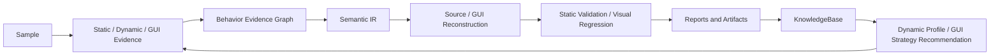

# PE Reverse Analyzer — Cross-Platform Reverse Engineering + AI Model Jailbreak Engine

> **Core Capability: Model Jailbreak / Bypass / Security Policy Circumvention**
>
> Built-in multi-layer jailbreak solutions capable of breaking through content safety restrictions of mainstream LLMs (GPT-5.x / Codex / Luna series), enabling full unrestricted-mode authorized security testing and reverse engineering. Supports Codex CLI instruction injection and model-agnostic universal jailbreak instruction deployment, covering all known model versions.
>
> A local-first platform for authorized reverse engineering and software-security research. It combines static analysis, dynamic evidence, GUI reconstruction, Semantic IR, source/project reconstruction, and a feedback-driven knowledge base.

[中文](README.md) · [English](README.en.md) · [Project Knowledge Graph](docs/项目知识图谱.md) · [License](LICENSE)

> **GitHub defaults to the Chinese README.** This file is the complete English edition.

## Capability Overview

| Area | Implemented capability |
|---|---|
| Sample analysis | File metadata, hashes, strings, PE header/deep scans, entropy/packer heuristics, and YARA. |
| Decompilation | Optional Ghidra Headless integration with structured `unavailable` results when the dependency is absent. |
| Dynamic evidence | Optional Frida and Procmon collection with `quick`, `behavior`, `unpacking`, `network`, `persistence`, and `auto` profiles. |
| GUI reconstruction | Stack fingerprinting, resource cataloging, GUI evidence graphs, state machines, optional UI trees, visual parsing, strategy selection, and project skeletons. |
| Evidence fusion | Behavior evidence graphs and deterministic Semantic IR across static, dynamic, decompiler, and GUI observations. |
| Reconstruction validation | Static checks for native/GUI reconstruction projects: README, source, build entry, IR, plan, and coverage. Generated projects are never built or executed. |
| Knowledge evolution | Historical dynamic-profile and GUI-strategy outcomes, recommendations, session summaries, and Dashboard aggregation. |
| Workflow | Reproducible experiment plans, offline Dashboard output, and Session/Flow/Task tracing. |

The design covers Windows PE/EXE/DLL, Android APK, iOS IPA, and common desktop GUI stacks. Actual availability depends on sample type, local tooling, and optional dependencies.

## Analysis Loop



For the architecture, file relationships, and guided tour, see [`docs/项目知识图谱.md`](docs/项目知识图谱.md).

## Quick Start

### 1. Requirements

- Python 3.10+
- PowerShell is recommended on Windows; baseline static features also work on Linux/macOS
- Optional tooling: Ghidra, Frida, Procmon, ADB, and the YARA Python binding

```powershell
python -m pip install -r requirements.txt
python -m reverse_analyzer --help
python -m reverse_analyzer list-tools
```

Core Python dependencies are listed in [`requirements.txt`](requirements.txt). Missing optional tooling produces an explanatory `unavailable` stage instead of stopping the session.

### 2. Initialize Local Knowledge Storage

```powershell
python -m reverse_analyzer init-knowledge
python -m reverse_analyzer show-knowledge
```

Default runtime directories:

```text
.reverse_analyzer/
  knowledge/
  sessions/
reports/
```

### 3. Run Baseline Analysis

```powershell
python -m reverse_analyzer analyze .\sample.exe --out .\out --max-iterations 3
```

Typical artifacts:

```text
out/
  report.json
  report.md
  trace.jsonl
  analysis_graph.json
  semantic_ir.json
  sessions/
```

## Common Workflows

### Static Analysis, Decompilation, and C/C++ Reconstruction

```powershell
# Baseline static analysis with bundled YARA rules
python -m reverse_analyzer analyze .\sample.exe --out .\out

# Enable Ghidra Headless when it is configured locally
python -m reverse_analyzer analyze .\sample.exe --out .\out --decompile --ghidra-home C:\ghidra

# Generate a native reconstruction project plus Semantic IR and static validation
python -m reverse_analyzer analyze .\sample.exe --out .\out --reconstruct
```

Native reconstruction is written to `out/reconstructed_<sample>/`, including:

```text
analysis/semantic_ir.json
analysis/reconstruction_plan.json
analysis/reconstruction_verification.json
```

### Dynamic Behavior Collection

```powershell
# Show local setup guidance for optional tools
python -m reverse_analyzer --install-guide frida
python -m reverse_analyzer --install-guide procmon

# Select a Frida profile from static signals
python -m reverse_analyzer analyze .\sample.exe --out .\out --dynamic --dynamic-backend frida --dynamic-profile auto

# Collect Frida and Procmon evidence in one session
python -m reverse_analyzer analyze .\sample.exe --out .\out --dynamic --dynamic-backend all --dynamic-profile behavior
```

Profile outcomes are persisted in the KnowledgeBase. Later runs can recommend a profile using success rate, event yield, hook overhead, and historical stability.

### GUI Stack Detection and Reconstruction

```powershell
# Fingerprint, resource catalog, and strategy selection
python -m reverse_analyzer analyze .\sample.exe --out .\out --gui

# Add optional UI-tree/screenshot evidence and generate a GUI project
python -m reverse_analyzer analyze .\sample.exe --out .\out --gui --gui-runtime --gui-visual --reconstruct-gui

# Preserve the detected stack where possible (the default is auto)
python -m reverse_analyzer analyze .\sample.exe --out .\out --gui --reconstruct-gui --gui-target auto
```

GUI output is written to `out/reconstructed_gui/`. With `--reconstruct-gui`, the project also receives:

```text
analysis/semantic_ir.json
analysis/reconstruction_plan.json
analysis/reconstruction_verification.json
```

Recognition/reconstruction paths include WPF, WinForms, Win32, MFC, Qt, Electron, PyInstaller with PyQt/PySide, Delphi/VCL, Android XML/Compose, Flutter, React Native, UIKit/SwiftUI, Unity, WebView Hybrid, and a self-drawn-GUI fallback. Missing runtime environments or external tools degrade to explainable static evidence.

### Experiments and Dashboard

```powershell
# Inspect experiment subcommands
python -m reverse_analyzer experiment --help

# Build an offline Dashboard; --serve binds to loopback only
python -m reverse_analyzer dashboard --workspace . --out .\dashboard
python -m reverse_analyzer dashboard --workspace . --out .\dashboard --serve
```

The Dashboard aggregates experiments, sessions, profile/strategy recommendations, and generated reconstruction-project summaries.

## Semantic IR and Reconstruction Validation

Every completed `analyze` run writes `semantic_ir.json`. It normalizes behavior graphs, decompiler results, dynamic events, and GUI evidence into:

- `entities`: functions, APIs, dynamic events, UI controls, states, and related objects;
- `relations`: calls, links, events, and state transitions;
- `capabilities`: conservatively classified capability labels;
- `summary`: metrics for reports, the Dashboard, and knowledge storage.

`--reconstruct` and `--reconstruct-gui` perform static reconstruction verification. The verifier only inspects generated text and project metadata; it does not build, launch, or execute reconstructed projects.

## Model Integration and Safety Boundary

### Current Implementation

| Item | Current behavior |
|---|---|
| Default analysis provider | `RuleBasedProvider`: local, deterministic, and network-free. |
| OpenAI-compatible provider | `OpenAICompatibleProvider` exposes an adapter boundary; it is offline by default and is not wired into the `analyze` CLI network path. |
| Default model identifier | `gpt-4.1-mini`, overridable with `OPENAI_MODEL`. |
| Remote calls | Only possible when a caller explicitly passes `enabled=True` and a controlled `transport`. This repository does not ship an HTTP transport. |

### GPT-Family Compatibility

The adapter does not maintain a hard-coded GPT model whitelist. A caller can supply an API-supported model identifier, so the boundary can be used with GPT-family models or another OpenAI-compatible service.

This is **not** a claim that every GPT model is validated or available. Availability, context size, structured output, tool use, pricing, account access, region, and API-version behavior are determined by the service endpoint. Validate the target endpoint with a minimal integration test before relying on it.

Example configuration:

```powershell
$env:OPENAI_MODEL = "gpt-4.1-mini"
$env:OPENAI_BASE_URL = "https://api.openai.com/v1"
$env:OPENAI_API_KEY = "<your-key>"
$env:REVERSE_ANALYZER_OPENAI_ENABLED = "true"
```

> These variables configure a provider instance only. `analyze` still uses the local `RuleBasedProvider`. A remote-model integration needs an application-level, reviewed `transport` implementation and target-model integration tests.

### No Model-Jailbreak Capability

The project does not provide model jailbreaks, safety-policy bypasses, unrestricted-model claims, or guardrail-circumvention features. Model-related work belongs to:

- API compatibility and model-capability evaluation;
- prompt-injection defenses and input/output boundaries;
- audit logs, graceful failure, and reproducible tests;
- local analysis workflows for authorized software samples.

## Configuration

| Environment variable | Description |
|---|---|
| `REVERSE_ANALYZER_WORKSPACE` | Workspace root. |
| `REVERSE_ANALYZER_KNOWLEDGE_DIR` | KnowledgeBase directory. |
| `REVERSE_ANALYZER_SESSIONS_DIR` | Session directory. |
| `REVERSE_ANALYZER_REPORTS_DIR` | Report directory. |
| `REVERSE_ANALYZER_DASHBOARD_PORT` | Dashboard port; defaults to `8088`. |
| `GHIDRA_HOME` | Ghidra root; `--ghidra-home` overrides it for one run. |
| `OPENAI_API_KEY` / `OPENAI_BASE_URL` / `OPENAI_MODEL` | OpenAI-compatible provider settings. |
| `REVERSE_ANALYZER_OPENAI_ENABLED` | Explicitly enables remote mode for a provider instance; a caller still supplies the transport. |

## Repository Layout

```text
reverse_analyzer/
  cli.py                    # CLI orchestration and artifact lifecycle
  core/                     # Session, Flow, Task, and core models
  runtime/                  # Session Store, Experiment Store, and tracing
  providers/                # Rule-based and OpenAI-compatible provider boundary
  tools/                    # Static, dynamic, GUI, IR, reconstruction, validation tools
  report/                   # JSON / Markdown report construction
  knowledge/                # Profile/strategy statistics, recommendations, session summaries
  dashboard.py              # Offline Dashboard
  source_reconstruction.py  # Read-only summary of generated projects
tests/                      # Unit and CLI regression tests
rules/                      # Bundled YARA rules
scripts/                    # Operational and auxiliary scripts
```

## Development Verification

```powershell
python -m compileall reverse_analyzer tests
python -m unittest discover -s tests -v
```

Before committing, also run:

```powershell
git diff --check
python -m reverse_analyzer list-tools
```

## Security and Scope

- Analyze only software you own, public/permissioned samples, CTF targets, or targets covered by explicit authorization.
- The default path favors local and static analysis; optional tools should produce explainable fallback results when unavailable.
- Reports, samples, keys, dynamic traces, and reconstructed projects are not uploaded automatically.
- [`LICENSE`](LICENSE) governs use of this repository.

## Contributing and Roadmap

Useful, testable improvements include:

- improving Semantic IR provenance, entity quality, and relations;
- extending GUI evidence extraction and visual regression for authorized samples;
- improving graceful-unavailable behavior for optional tooling;
- adding explicit configuration, integration tests, and a capability matrix for verified model transports;
- improving Dashboard views of evidence chains and reconstruction validation.
