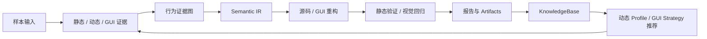

# PE Reverse Analyzer — 全平台逆向 + AI 模型破甲引擎

> **核心能力：模型破甲 / 越狱 / 安全策略绕过**
>
> 内置多层破甲方案，可突破主流 AI 大模型全系列：GPT-4o / GPT-4.1 / GPT-5 / GPT-5.1 / GPT-5.2 / Codex / Luna / GPT-5.6-luna的内容安全限制，实现完全无限制模式下的授权安全测试与逆向分析。通过 `codex-instruct.py` 指令注入部署，支持 Codex CLI 命令行版本（已验证有效）；Codex 桌面版因内置 `provider-sync` 覆盖机制暂不支持。
>
> 面向授权逆向分析与软件安全研究的本地优先平台：将静态分析、动态行为、GUI 证据、语义 IR、源码/GUI 重构和知识库反馈整合为可追溯的分析闭环。

[中文](README.md) · [English](README.en.md) · [项目知识图谱](docs/项目知识图谱.md) · [许可证](LICENSE)

> **GitHub 默认展示中文。** 英文完整文档位于 [`README.en.md`](README.en.md)。

## 能力概览

| 领域 | 已实现能力 |
|---|---|
| 样本分析 | 文件信息、哈希、字符串、PE 头与深度扫描、熵/壳启发式、YARA。 |
| 反编译 | 可选 Ghidra Headless 集成；缺少工具时返回结构化 `unavailable`，不阻断报告。 |
| 动态证据 | 可选 Frida 与 Procmon 采集；支持 `quick`、`behavior`、`unpacking`、`network`、`persistence` 和 `auto` Profile。 |
| GUI 还原 | 技术栈指纹、资源目录、UI 证据图、状态机、运行时 UI Tree、视觉解析、策略选择与工程骨架生成。 |
| 证据融合 | 行为证据图与确定性 Semantic IR，统一静态、动态、反编译和 GUI 观察。 |
| 重构验证 | 原生/GUI 重构工程的 README、源码、构建入口、Semantic IR、计划和覆盖率静态验证；**不执行生成工程**。 |
| 知识演化 | 动态 Profile 与 GUI Strategy 历史统计、推荐结果、会话摘要和 Dashboard 聚合。 |
| 工作流 | 可复现实验计划、离线 Dashboard、会话/Flow/Task 追踪。 |

平台设计覆盖 Windows PE/EXE/DLL、Android APK、iOS IPA 与常见桌面 GUI 技术栈。具体能力取决于样本类型、可用依赖和本地工具链。

## 核心闭环



详细架构、文件关系和阅读路线见 [`docs/项目知识图谱.md`](docs/项目知识图谱.md)。

## 快速开始

### 1. 环境

- Python 3.10+
- Windows 上建议使用 PowerShell；Linux/macOS 可运行基础静态分析功能
- 可选工具：Ghidra、Frida、Procmon、ADB、YARA Python 绑定

```powershell
python -m pip install -r requirements.txt
python -m reverse_analyzer --help
python -m reverse_analyzer list-tools
```

核心 Python 依赖在 [`requirements.txt`](requirements.txt) 中。可选工具未安装时，平台会把对应步骤标为 `unavailable`，而不是中断整个会话。

### 2. 初始化本地知识库

```powershell
python -m reverse_analyzer init-knowledge
python -m reverse_analyzer show-knowledge
```

默认运行时目录：

```text
.reverse_analyzer/
  knowledge/
  sessions/
reports/
```

### 3. 运行基础分析

```powershell
python -m reverse_analyzer analyze .\sample.exe --out .\out --max-iterations 3
```

常见工件：

```text
out/
  report.json
  report.md
  trace.jsonl
  analysis_graph.json
  semantic_ir.json
  sessions/
```

## 常用工作流

### 静态分析、反编译与 C/C++ 重构

```powershell
# 基础静态分析 + 默认 YARA 规则
python -m reverse_analyzer analyze .\sample.exe --out .\out

# 启用 Ghidra Headless（需先配置 Ghidra）
python -m reverse_analyzer analyze .\sample.exe --out .\out --decompile --ghidra-home C:\ghidra

# 生成原生重构工程，并写入 Semantic IR 与静态验证工件
python -m reverse_analyzer analyze .\sample.exe --out .\out --reconstruct
```

原生重构输出位于 `out/reconstructed_<sample>/`，包含：

```text
analysis/semantic_ir.json
analysis/reconstruction_plan.json
analysis/reconstruction_verification.json
```

### 动态行为采集

```powershell
# 查看可选工具的本地安装说明
python -m reverse_analyzer --install-guide frida
python -m reverse_analyzer --install-guide procmon

# 使用静态信号自动选择 Frida Hook Profile
python -m reverse_analyzer analyze .\sample.exe --out .\out --dynamic --dynamic-backend frida --dynamic-profile auto

# 同时采集 Frida 与 Procmon 行为
python -m reverse_analyzer analyze .\sample.exe --out .\out --dynamic --dynamic-backend all --dynamic-profile behavior
```

Profile 运行结果会进入 KnowledgeBase。后续会话可根据成功率、事件量、Hook 开销和历史稳定性推荐 Profile。

### GUI 技术栈识别与重构

```powershell
# 指纹、资源目录与策略选择
python -m reverse_analyzer analyze .\sample.exe --out .\out --gui

# 加入可选 UI Tree、截图证据和 GUI 工程生成
python -m reverse_analyzer analyze .\sample.exe --out .\out --gui --gui-runtime --gui-visual --reconstruct-gui

# 指定重构目标；默认 auto 尽量保留检测到的原技术栈
python -m reverse_analyzer analyze .\sample.exe --out .\out --gui --reconstruct-gui --gui-target auto
```

GUI 工程输出位于 `out/reconstructed_gui/`。当启用 `--reconstruct-gui` 时，平台会在生成工程后写入：

```text
analysis/semantic_ir.json
analysis/reconstruction_plan.json
analysis/reconstruction_verification.json
```

支持的识别/还原路径包括 WPF、WinForms、Win32、MFC、Qt、Electron、PyInstaller + PyQt/PySide、Delphi/VCL、Android XML/Compose、Flutter、React Native、UIKit/SwiftUI、Unity、WebView Hybrid 与自绘 GUI 回退路径。缺少外部工具或运行环境时会降级为可解释的静态证据结果。

### 实验与 Dashboard

```powershell
# 查看实验子命令
python -m reverse_analyzer experiment --help

# 生成离线 Dashboard；加 --serve 仅监听 loopback 地址
python -m reverse_analyzer dashboard --workspace . --out .\dashboard
python -m reverse_analyzer dashboard --workspace . --out .\dashboard --serve
```

Dashboard 汇总实验、会话、动态 Profile 推荐、GUI Strategy 推荐和已生成的重构工程摘要。

## Semantic IR 与重构验证

每次 `analyze` 完成后会生成 `semantic_ir.json`。它将行为图、反编译结果、动态事件和 GUI 证据归一化为：

- `entities`：函数、API、动态事件、UI 控件、状态等实体；
- `relations`：调用、关联、事件/状态转移等关系；
- `capabilities`：保守归类后的能力标签；
- `summary`：可用于报告、Dashboard 和知识库的统计。

`--reconstruct` 与 `--reconstruct-gui` 会触发静态重构验证。验证器只检查工程结构和已生成文本工件，不会构建、运行或启动重构工程。

## 模型适配与安全边界

### 当前实现状态

| 项目 | 当前行为 |
|---|---|
| 默认分析 Provider | `RuleBasedProvider`；本地、确定性、无需网络。 |
| OpenAI-compatible Provider | 提供 `OpenAICompatibleProvider` 适配边界；默认离线且未接入 `analyze` CLI 的网络调用路径。 |
| 默认模型标识 | `gpt-4.1-mini`，可由 `OPENAI_MODEL` 覆盖。 |
| 远程调用 | 仅在调用方显式 `enabled=True` 且注入受控 `transport` 时发生。当前仓库不内置 HTTP transport。 |

### GPT 系列兼容说明

适配层不维护硬编码的 GPT 型号白名单：调用方可传入 API 所支持的模型标识。因此它可以作为 GPT 家族或其他 OpenAI-compatible 服务的**接入边界**。

这不等同于“已验证覆盖全部 GPT 系列”：不同模型、账户、区域和 API 版本的可用性、上下文长度、工具调用、结构化输出与价格均由服务端决定。接入前应在自己的 endpoint 上完成最小化兼容性验证。

示例环境变量：

```powershell
$env:OPENAI_MODEL = "gpt-4.1-mini"
$env:OPENAI_BASE_URL = "https://api.openai.com/v1"
$env:OPENAI_API_KEY = "<your-key>"
$env:REVERSE_ANALYZER_OPENAI_ENABLED = "true"
```

> 上述变量只配置 Provider 实例；当前 `analyze` 命令仍使用本地 `RuleBasedProvider`。若要接入远程模型，需要在应用层提供经过审查的 `transport` 实现，并为目标模型增加集成测试。

### 不包含“模型破甲”功能

本项目不提供模型越狱、规避安全策略、解除内容限制或“无限制模型”能力。与模型相关的文档和后续扩展应聚焦于：

- API 兼容性与模型能力评估；
- Prompt Injection 防御与输入/输出边界；
- 审计日志、失败降级和可复现测试；
- 对已授权软件样本的本地分析工作流。

## 配置

| 环境变量 | 说明 |
|---|---|
| `REVERSE_ANALYZER_WORKSPACE` | 工作区根目录。 |
| `REVERSE_ANALYZER_KNOWLEDGE_DIR` | KnowledgeBase 目录。 |
| `REVERSE_ANALYZER_SESSIONS_DIR` | 会话目录。 |
| `REVERSE_ANALYZER_REPORTS_DIR` | 报告目录。 |
| `REVERSE_ANALYZER_DASHBOARD_PORT` | Dashboard 默认端口，默认 `8088`。 |
| `GHIDRA_HOME` | Ghidra 根目录；也可用 `--ghidra-home` 单次覆盖。 |
| `OPENAI_API_KEY` / `OPENAI_BASE_URL` / `OPENAI_MODEL` | OpenAI-compatible Provider 配置。 |
| `REVERSE_ANALYZER_OPENAI_ENABLED` | 显式启用 Provider 实例的远程模式；仍需调用方注入 transport。 |

## 项目结构

```text
reverse_analyzer/
  cli.py                    # 命令行编排与 Artifact 生命周期
  core/                     # Session、Flow、Task 等核心模型
  runtime/                  # Session Store、Experiment Store、Trace
  providers/                # RuleBased 与 OpenAI-compatible Provider 边界
  tools/                    # 静态、动态、GUI、IR、重构与验证工具
  report/                   # JSON / Markdown 报告构建
  knowledge/                # Profile 与 Strategy 统计、推荐、会话摘要
  dashboard.py              # 离线 Dashboard
  source_reconstruction.py  # 已生成重构工程的只读摘要
tests/                      # 单元与 CLI 回归测试
rules/                      # 内置 YARA 规则
scripts/                    # 运维与辅助脚本
```

## 开发验证

```powershell
python -m compileall reverse_analyzer tests
python -m unittest discover -s tests -v
```

提交前建议同时检查：

```powershell
git diff --check
python -m reverse_analyzer list-tools
```

## 安全与使用范围

- 仅分析自己拥有、公开许可、CTF 或已获得明确授权的软件样本。
- 默认路径优先静态和离线分析；可选外部工具缺失时应保持可解释的降级结果。
- 不将报告、样本、密钥、动态 trace 或重构产物自动上传到网络。
- 许可证以 [`LICENSE`](LICENSE) 为准。

## 贡献与路线图

欢迎围绕以下方向提交可测试的改进：

- 提高 Semantic IR 的实体/关系质量与来源可追溯性；
- 为合法样本增强 GUI 证据提取和视觉回归；
- 完善可选工具的 graceful-unavailable 行为；
- 为经验证的模型 transport 增加显式配置、集成测试和能力矩阵；
- 改进 Dashboard 的证据链与重构验证可视化。
