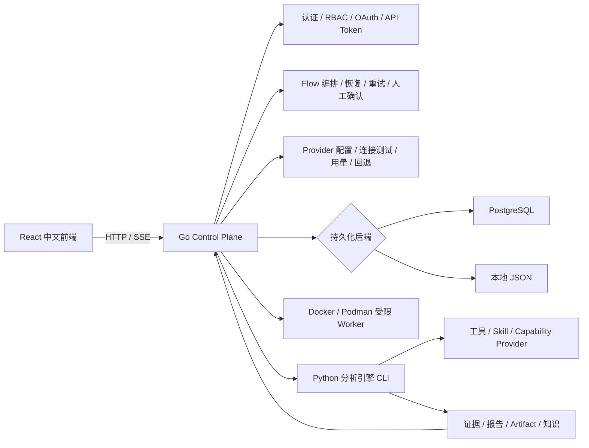
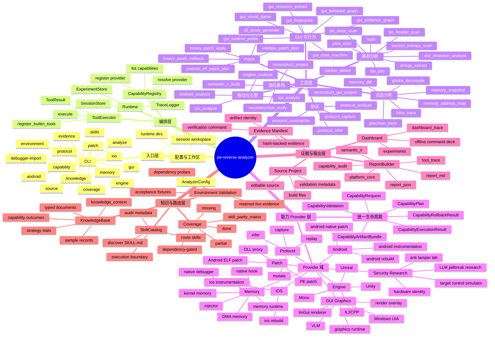
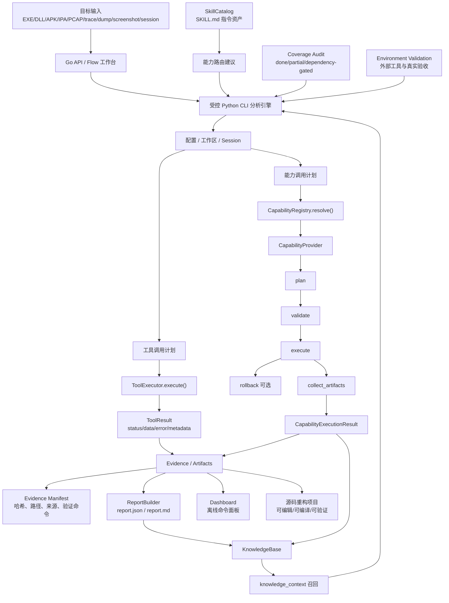
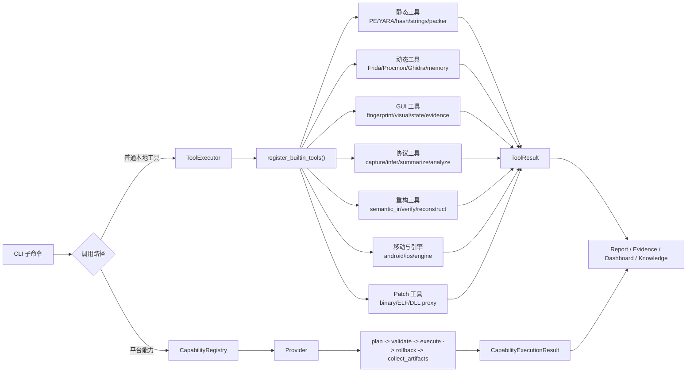
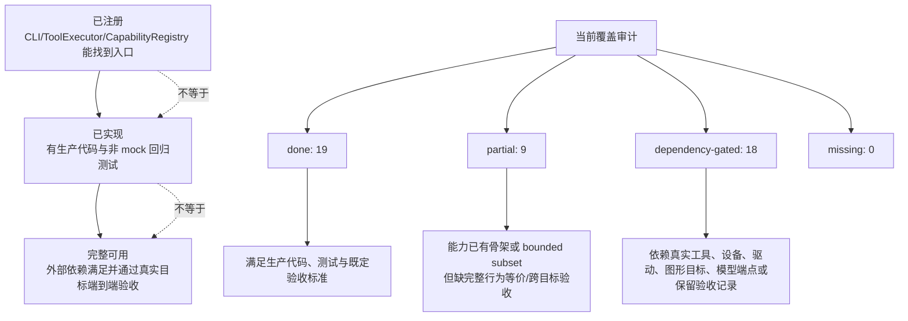

# 项目整体架构导图

> 本图用于理解 `pe-reverse-analyzer` 的平台分层、数据流转、接口调用与能力状态边界。

## 零、部署架构（单 Go 后端）

部署时只有 `reverse-analyzer-server` 对外监听。Python 不提供 Web API，只作为 Go worker 明确调用的分析引擎；`python -m reverse_analyzer web` 也只负责启动 Go 控制面。

## 一、平台总览

## 二、数据流转导图

## 三、接口与工具调用导图

## 四、状态边界导图

## 五、模块定位速查

| 模块 | 角色 |
| --- | --- |
| `cmd/reverse-analyzer-server/` | 唯一 Web 后端、认证、Flow、SSE、Provider、持久化与 worker 调度 |
| `frontend/` | React 中文控制台，通过 Go API 工作 |
| `reverse_analyzer/cli.py` | 平台主入口与命令编排 |
| `reverse_analyzer/tools/executor.py` | 本地工具注册与统一执行 |
| `reverse_analyzer/tools/static_tools.py` | 内置工具注册清单 |
| `reverse_analyzer/core/capabilities/registry.py` | 能力 Provider 注册与解析 |
| `reverse_analyzer/core/capabilities/models.py` | Provider 生命周期数据模型 |
| `reverse_analyzer/providers/` | 各领域生产 Provider |
| `reverse_analyzer/runtime/` | session、trace、experiment 持久化 |
| `reverse_analyzer/report/builder.py` | 报告构建与平台核心汇总 |
| `reverse_analyzer/evidence/` | 证据 manifest 与哈希校验 |
| `reverse_analyzer/knowledge/base.py` | 知识库、typed documents、策略经验 |
| `reverse_analyzer/skills/catalog.py` | SKILL.md 发现、审计与路由 |
| `reverse_analyzer/coverage.py` | 能力覆盖矩阵审计 |
| `reverse_analyzer/instructions/` | 跨平台破甲指令部署：四平台适配器 + 统一安全模型 + `reverse-instruct` CLI |
| `docs/skill_parity_matrix.md` | 能力状态事实来源 |
| `docs/acceptance/` | 真实环境验收记录与说明 |

## 六、阅读顺序建议

1. 先看“平台总览”，理解项目被分成入口、编排、工具、Provider、证据、知识六层。
2. 再看“数据流转导图”，理解一次分析从输入到报告、知识召回如何闭环。
3. 然后看“接口与工具调用导图”，区分普通工具调用和 Provider 生命周期调用。
4. 接着看“状态边界导图”，避免把“已接入入口”误判为“真实目标完整可用”。
5. 跨平台指令部署是平台**之外**的独立交付物（`reverse_analyzer/instructions/`，`reverse-instruct` CLI），它注入 AI 客户端而非分析目标，阅读时与主分析引擎分开看；先读 `docs/跨平台破甲指令部署指南.md` 理解四平台注入机制，再对照源码走查。
