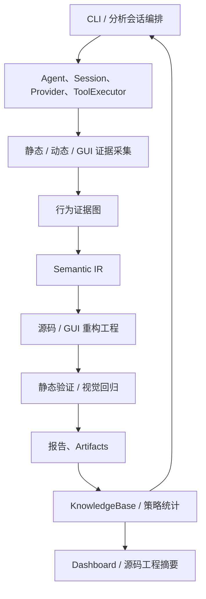

# PE Reverse Analyzer 项目知识图谱

> 图谱数据：`../.understand-anything/knowledge-graph.json`  
> 当前快照：536 个受管理文件、1,827 个节点、3,652 条关系、8 个分层、8 步导览。

## 核心闭环

## 架构分层

| 层 | 主要目录/模块 | 职责 |
|---|---|---|
| 入口与编排 | `reverse_analyzer/cli.py`、`config.py` | 参数解析、分析会话、工具调用顺序、工件和报告写入。 |
| 运行时与 Agent | `core/`、`runtime/`、`agent/`、`providers/` | 会话模型、任务流、Provider、规则式 Agent 与实验运行时。 |
| 分析与证据采集 | `tools/` 中的 PE、YARA、Ghidra、Frida、Procmon 工具 | 生成静态、动态和反编译证据，外部依赖不可用时优雅降级。 |
| 证据融合与重构 | GUI 工具、`behavior_graph.py`、`semantic_ir.py`、`reconstruct*.py` | 融合证据、建立语义 IR、生成重构工程并进行静态验证。 |
| 报告与知识演化 | `report/`、`knowledge/`、`dashboard.py`、`source_reconstruction.py` | 归一化结果、持久化策略效果、输出 Dashboard 数据。 |
| 质量保障 | `tests/` | 覆盖 CLI、工具、GUI、重构、知识库和 Dashboard 回归。 |
| 运维与参考资料 | `scripts/`、`rules/`、容器配置、演化数据、`docs/` | 安装、运行、规则和项目辅助资料。 |
| 逆向技能与参考语料 | `reverse-skills/` | 与平台运行时代码隔离展示的可复用技能、规则和参考材料。 |

## 推荐阅读路径

1. 从 `README.md` 和 `reverse_analyzer/cli.py` 了解命令入口与分析生命周期。
2. 查看 `reverse_analyzer/tools/static_tools.py` 与 `tools/executor.py`，理解工具注册和统一执行边界。
3. 沿 `behavior_graph.py` → `semantic_ir.py` → `reconstruct.py` / `reconstruction_verify.py` 阅读证据融合与源码还原闭环。
4. 沿 `gui.py`、`gui_evidence.py`、`gui_state.py`、`gui_xaml.py` 阅读 GUI 技术栈识别与还原路径。
5. 查看 `report/builder.py`、`knowledge/base.py` 和 `dashboard.py`，理解结果如何成为可学习、可视化的数据资产。
6. 使用图谱的 `tour` 字段按顺序浏览，或从 `tested_by` 边反向定位对应测试。

## 领域资料边界

`docs/game-hacking-techniques-SKILL.md` 在图谱中被建模为 **高风险研究参考/威胁建模文档**，并与 `research-safety-boundary` 概念关联。它不属于平台默认自动执行路径，也不会改变现有分析、重构或知识库流程。

## 图谱生成说明

本次优先尝试了 `codebase-memory-mcp` 与 `understand` 工具链；前者的索引传输不可用，后者缺少 `@understand-anything/core` 运行时。因此图谱采用确定性的静态回退：Git 文件清单、Python AST、模块导入、同文件调用、测试依赖和显式领域关系。校验结果保存在 `../.understand-anything/review.json`。
